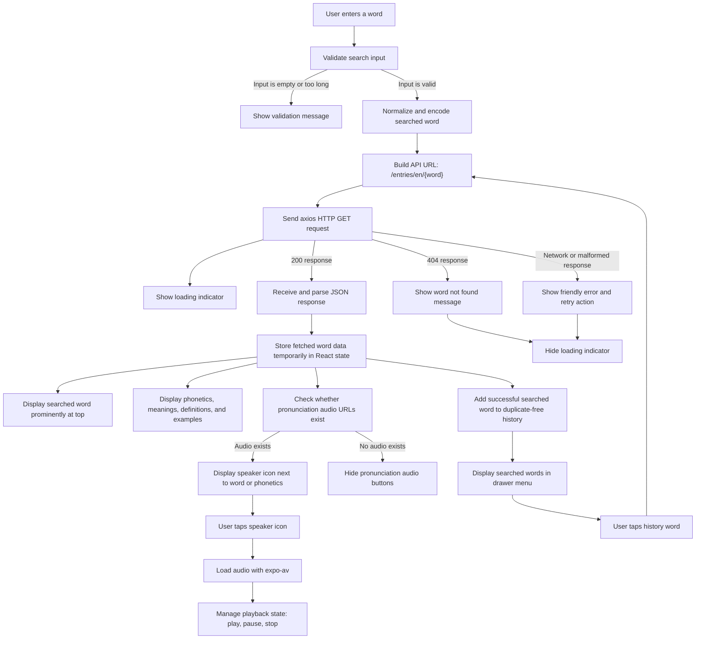

# Data Flow Diagram

## Main Data Stores

- `searchTerm`: Current text input value.
- `wordData`: Temporary API response used for the detail screen.
- `history`: Duplicate-free list of successfully searched words.
- `audioPlayback`: Current pronunciation URL and playback status.
- `feedback`: User-facing validation, error, and playback messages.
